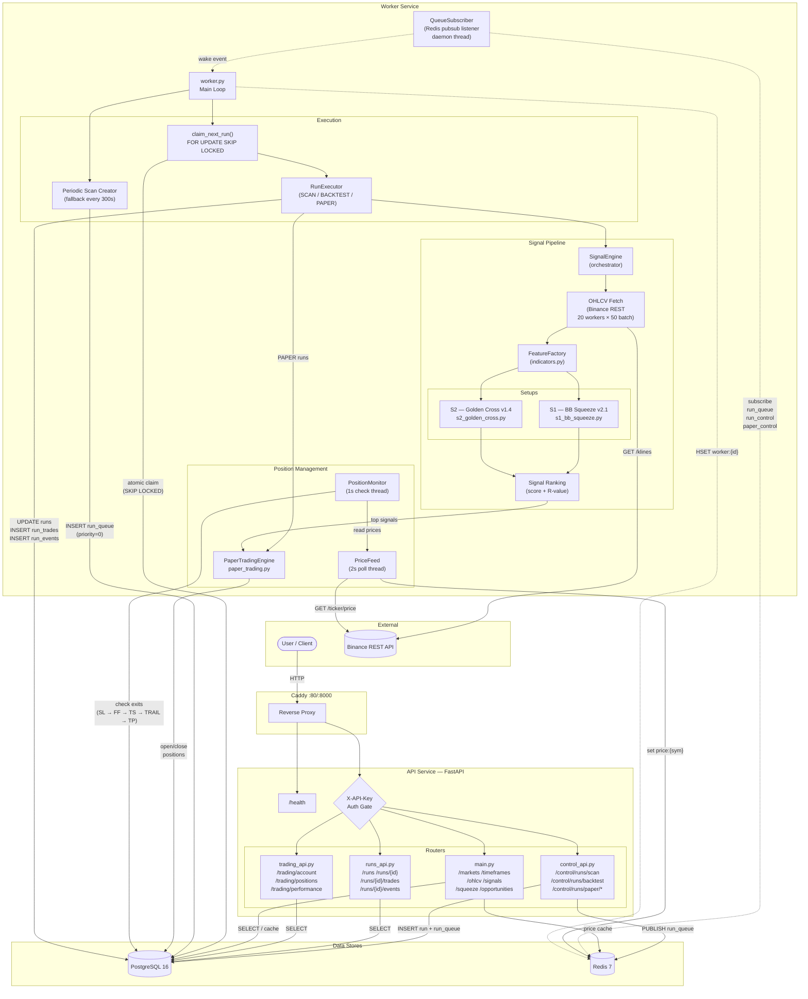
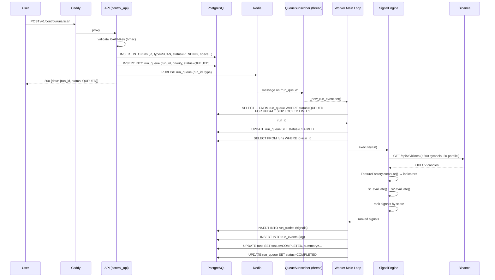
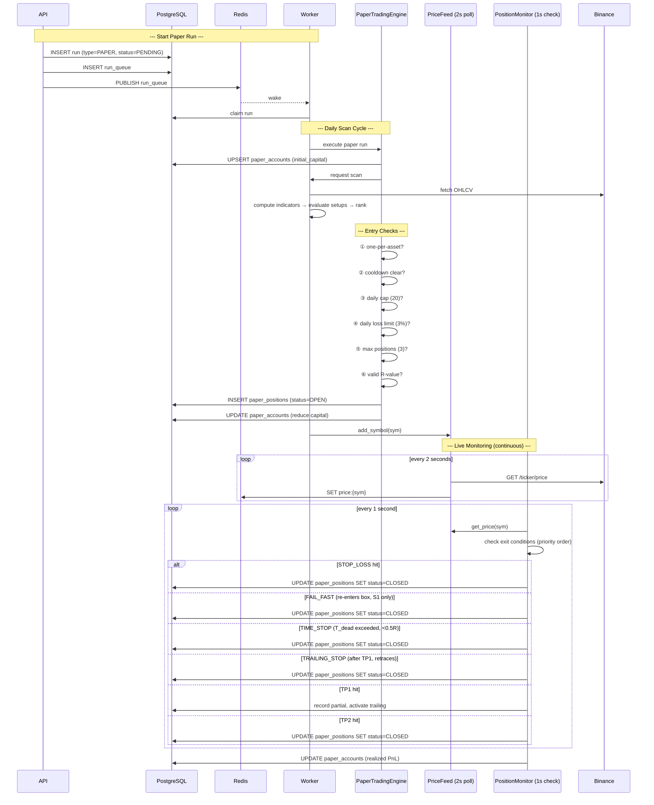
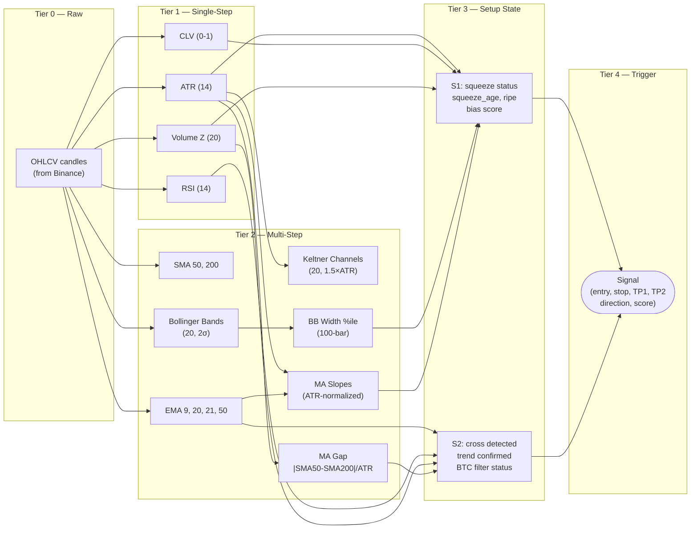

# MCAS Architecture

## System Overview

```mermaid
flowchart TB
    subgraph External
        USER([User / Client])
        BINANCE[(Binance REST API)]
    end

    subgraph CADDY [Caddy :80/:8000]
        PROXY[Reverse Proxy]
    end

    subgraph API_SVC [API Service — FastAPI]
        HEALTH["/health"]
        AUTH{"X-API-Key\nAuth Gate"}

        subgraph Routers
            MAIN["main.py\n/markets /timeframes\n/ohlcv /signals\n/squeeze /opportunities"]
            CTRL["control_api.py\n/control/runs/scan\n/control/runs/backtest\n/control/runs/paper/*"]
            RUNS_Q["runs_api.py\n/runs /runs/{id}\n/runs/{id}/trades\n/runs/{id}/events"]
            TRADE["trading_api.py\n/trading/account\n/trading/positions\n/trading/performance"]
        end
    end

    subgraph WORKER_SVC [Worker Service]
        WLOOP["worker.py\nMain Loop"]
        SUBSCRIBER["QueueSubscriber\n(Redis pubsub listener\ndaemon thread)"]

        subgraph Execution
            CLAIM["claim_next_run()\nFOR UPDATE SKIP LOCKED"]
            REXEC["RunExecutor\n(SCAN / BACKTEST / PAPER)"]
            PERIODIC["Periodic Scan Creator\n(fallback every 300s)"]
        end

        subgraph Signal Pipeline
            SENGINE["SignalEngine\n(orchestrator)"]
            OHLCV_FETCH["OHLCV Fetch\n(Binance REST\n20 workers × 50 batch)"]
            FF["FeatureFactory\n(indicators.py)"]

            subgraph Setups
                S1["S1 — BB Squeeze v2.1\ns1_bb_squeeze.py"]
                S2["S2 — Golden Cross v1.4\ns2_golden_cross.py"]
            end

            RANK["Signal Ranking\n(score + R-value)"]
        end

        subgraph Position Management
            PAPER["PaperTradingEngine\npaper_trading.py"]
            PFEED["PriceFeed\n(2s poll thread)"]
            PMON["PositionMonitor\n(1s check thread)"]
        end
    end

    subgraph Data Stores
        PG[(PostgreSQL 16)]
        RD[(Redis 7)]
    end

    %% --- User flow ---
    USER -->|HTTP| PROXY
    PROXY --> HEALTH
    PROXY --> AUTH
    AUTH --> MAIN
    AUTH --> CTRL
    AUTH --> RUNS_Q
    AUTH --> TRADE

    %% --- API → stores ---
    CTRL -->|"INSERT run + run_queue"| PG
    CTRL -->|"PUBLISH run_queue"| RD
    RUNS_Q -->|SELECT| PG
    TRADE -->|SELECT| PG
    MAIN -->|SELECT / cache| PG
    MAIN -->|price cache| RD

    %% --- Worker loop ---
    SUBSCRIBER -.->|"subscribe\nrun_queue\nrun_control\npaper_control"| RD
    SUBSCRIBER -.->|wake event| WLOOP
    WLOOP --> CLAIM
    CLAIM -->|"atomic claim\n(SKIP LOCKED)"| PG
    WLOOP --> PERIODIC
    PERIODIC -->|"INSERT run_queue\n(priority=0)"| PG
    CLAIM --> REXEC

    %% --- Signal pipeline ---
    REXEC --> SENGINE
    SENGINE --> OHLCV_FETCH
    OHLCV_FETCH -->|"GET /klines"| BINANCE
    OHLCV_FETCH --> FF

    FF --> S1
    FF --> S2
    S1 --> RANK
    S2 --> RANK

    %% --- Paper trading ---
    REXEC -->|"PAPER runs"| PAPER
    RANK -->|"top signals"| PAPER
    PAPER -->|"open/close\npositions"| PG

    PFEED -->|"GET /ticker/price"| BINANCE
    PFEED -->|"set price:{sym}"| RD
    PMON -->|"read prices"| PFEED
    PMON -->|"check exits\n(SL → FF → TS → TRAIL → TP)"| PG

    %% --- Heartbeat ---
    WLOOP -.->|"HSET worker:{id}"| RD

    %% --- Results ---
    REXEC -->|"UPDATE runs\nINSERT run_trades\nINSERT run_events"| PG
```

## Request Lifecycle: Queuing a Scan

```mermaid
sequenceDiagram
    participant U as User
    participant C as Caddy
    participant A as API (control_api)
    participant PG as PostgreSQL
    participant R as Redis
    participant SUB as QueueSubscriber (thread)
    participant W as Worker Main Loop
    participant SE as SignalEngine
    participant BN as Binance

    U->>C: POST /v1/control/runs/scan
    C->>A: proxy
    A->>A: validate X-API-Key (hmac)
    A->>PG: INSERT INTO runs (id, type=SCAN, status=PENDING, specs...)
    A->>PG: INSERT INTO run_queue (run_id, priority, status=QUEUED)
    A->>R: PUBLISH run_queue {run_id, type}
    A-->>U: 200 {data: {run_id, status: QUEUED}}

    R-->>SUB: message on "run_queue"
    SUB-->>W: _new_run_event.set()

    W->>PG: SELECT ... FROM run_queue WHERE status=QUEUED<br/>FOR UPDATE SKIP LOCKED LIMIT 1
    PG-->>W: run_id
    W->>PG: UPDATE run_queue SET status=CLAIMED
    W->>PG: SELECT FROM runs WHERE id=run_id
    W->>SE: execute(run)

    SE->>BN: GET /api/v3/klines (×200 symbols, 20 parallel)
    BN-->>SE: OHLCV candles
    SE->>SE: FeatureFactory.compute() → indicators
    SE->>SE: S1.evaluate() + S2.evaluate()
    SE->>SE: rank signals by score

    SE-->>W: ranked signals
    W->>PG: INSERT INTO run_trades (signals)
    W->>PG: INSERT INTO run_events (log)
    W->>PG: UPDATE runs SET status=COMPLETED, summary=...
    W->>PG: UPDATE run_queue SET status=COMPLETED
```

## Paper Trading Position Lifecycle

```mermaid
sequenceDiagram
    participant A as API
    participant PG as PostgreSQL
    participant R as Redis
    participant W as Worker
    participant PT as PaperTradingEngine
    participant PF as PriceFeed (2s poll)
    participant PM as PositionMonitor (1s check)
    participant BN as Binance

    Note over A,W: --- Start Paper Run ---
    A->>PG: INSERT run (type=PAPER, status=PENDING)
    A->>PG: INSERT run_queue
    A->>R: PUBLISH run_queue
    R-->>W: wake
    W->>PG: claim run

    Note over W,PT: --- Daily Scan Cycle ---
    W->>PT: execute paper run
    PT->>PG: UPSERT paper_accounts (initial_capital)
    PT->>W: request scan
    W->>BN: fetch OHLCV
    W->>W: compute indicators → evaluate setups → rank

    Note over PT: --- Entry Checks ---
    PT->>PT: ① one-per-asset?
    PT->>PT: ② cooldown clear?
    PT->>PT: ③ daily cap (20)?
    PT->>PT: ④ daily loss limit (3%)?
    PT->>PT: ⑤ max positions (3)?
    PT->>PT: ⑥ valid R-value?

    PT->>PG: INSERT paper_positions (status=OPEN)
    PT->>PG: UPDATE paper_accounts (reduce capital)
    W->>PF: add_symbol(sym)

    Note over PF,PM: --- Live Monitoring (continuous) ---
    loop every 2 seconds
        PF->>BN: GET /ticker/price
        PF->>R: SET price:{sym}
    end

    loop every 1 second
        PM->>PF: get_price(sym)
        PM->>PM: check exit conditions (priority order)

        alt STOP_LOSS hit
            PM->>PG: UPDATE paper_positions SET status=CLOSED
        else FAIL_FAST (re-enters box, S1 only)
            PM->>PG: UPDATE paper_positions SET status=CLOSED
        else TIME_STOP (T_dead exceeded, <0.5R)
            PM->>PG: UPDATE paper_positions SET status=CLOSED
        else TRAILING_STOP (after TP1, retraces)
            PM->>PG: UPDATE paper_positions SET status=CLOSED
        else TP1 hit
            PM->>PG: record partial, activate trailing
        else TP2 hit
            PM->>PG: UPDATE paper_positions SET status=CLOSED
        end
    end

    PM->>PG: UPDATE paper_accounts (realized PnL)
```

## Indicator Tier Model

```mermaid
flowchart LR
    subgraph "Tier 0 — Raw"
        OHLCV["OHLCV candles\n(from Binance)"]
    end

    subgraph "Tier 1 — Single-Step"
        ATR["ATR (14)"]
        CLV["CLV (0-1)"]
        VOLZ["Volume Z (20)"]
        RSI["RSI (14)"]
    end

    subgraph "Tier 2 — Multi-Step"
        SMA["SMA 50, 200"]
        EMA["EMA 9, 20, 21, 50"]
        BB["Bollinger Bands\n(20, 2σ)"]
        KC["Keltner Channels\n(20, 1.5×ATR)"]
        BBW["BB Width %ile\n(100-bar)"]
        SLOPES["MA Slopes\n(ATR-normalized)"]
        GAP["MA Gap\n|SMA50-SMA200|/ATR"]
    end

    subgraph "Tier 3 — Setup State"
        S1S["S1: squeeze status\nsqueeze_age, ripe\nbias score"]
        S2S["S2: cross detected\ntrend confirmed\nBTC filter status"]
    end

    subgraph "Tier 4 — Trigger"
        SIG(["Signal\n(entry, stop, TP1, TP2\ndirection, score)"])
    end

    OHLCV --> ATR & CLV & VOLZ & RSI
    ATR --> KC & SLOPES & GAP
    OHLCV --> SMA & EMA & BB
    BB --> BBW
    EMA --> SLOPES

    ATR & CLV & VOLZ & BBW & SLOPES --> S1S
    EMA & RSI & VOLZ --> S2S
    GAP --> S2S

    S1S --> SIG
    S2S --> SIG
```
